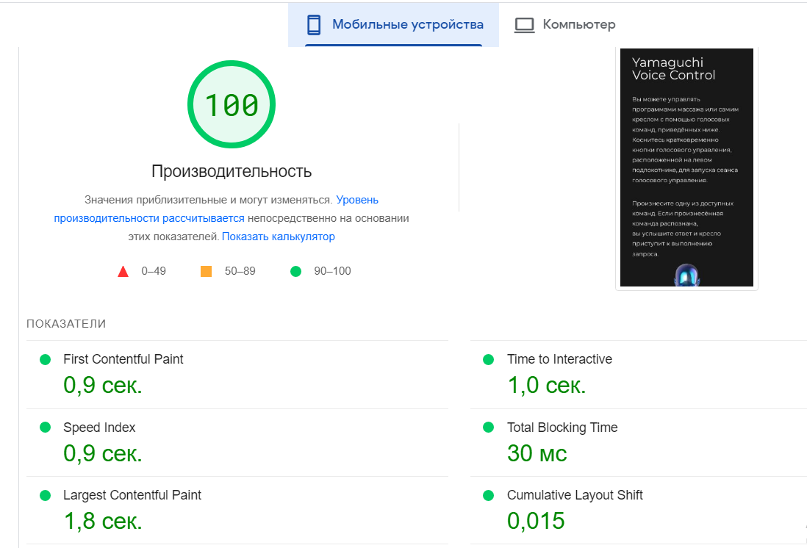
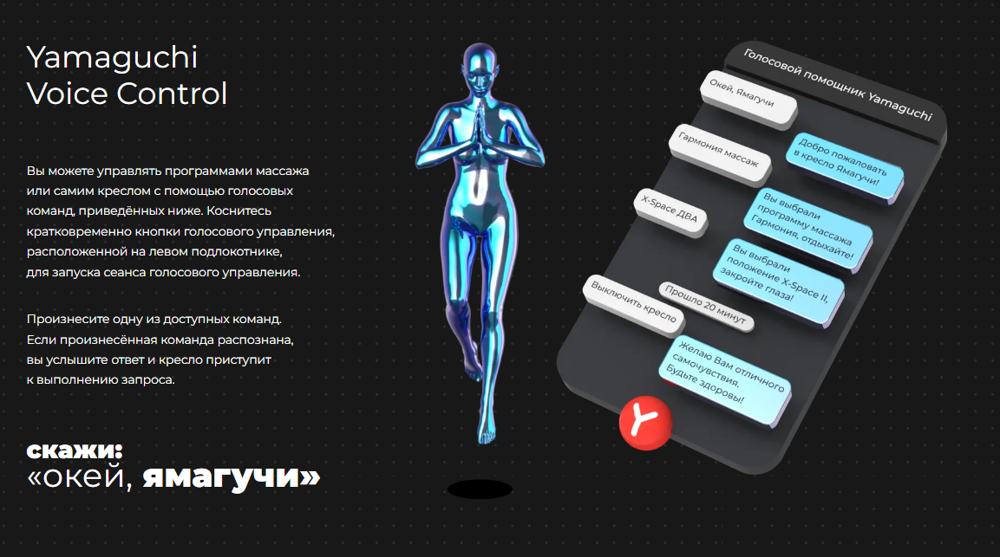
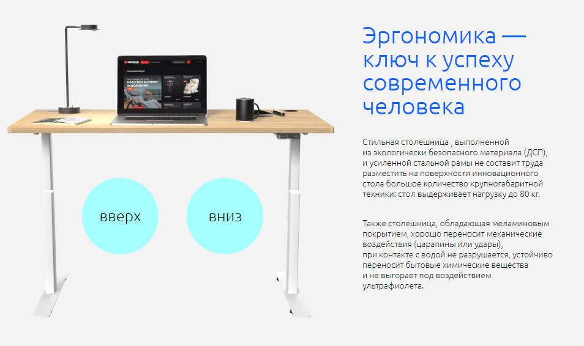

# YAMAGUCHI 

> Тестовое задание. 

## Описание

На всех страницах заголовки являются ссылками для перехода на другие странжицы. Данные в фигме отличались от визуального оформления, поэтому решил делать по данным из Inspect. Изначально было задано слишком большое расширение для десктопа (1920px), поэтому, возможно, необходимо уменьшить масштаб в DevTools или в браузере для просмотра десктопной версии.

## Cкриншоты

## Команды

<table>
  <thead>
    <tr>
      <th>Команда</th>
      <th>Результат</th>
    </tr>
  </thead>
  <tbody>
    <tr>
      <td width="30%"><code>npm install</code></td>
      <td>Установить зависимости</td>
    </tr>
    <tr>
      <td><code>gulp</code></td>
      <td>Запустить приложение в режиме разработки.</td>
    </tr>     
    <tr>
      <td><code>gulp build</code></td>
      <td>Собрать проект для продакшена</td>
    </tr>
  </tbody>
</table>

## Используемые технологии

HTML, CSS, JS, SCSS, GULP

